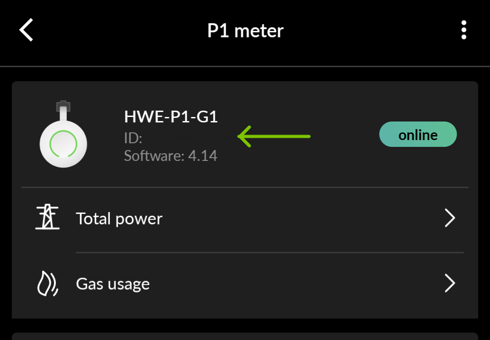

# HomeWizard to EnergyId

[](https://github.com/codespaces/new?machine=basicLinux32gb&repo=612398925&ref=main)


**homewizard-webhooks** is small tool to synchronize data from [HomeWizard](https://www.homewizard.com/) devices to your [EnergyID](https://app.energyid.eu/) dashboard.

Since HomeWizard devices API are only available within your local network, using an [EnergyID App](https://app.energyid.eu/integrations) to synchronize the data is not possible.  
**homewizard-webhooks** helps bridge the gap by reading the data from your local network and sending them to EnergyId using the WebHook App

## Prerequisites

### EnergyID

Before you start, you need to create a webhook in EnergyID to let the tool push the data to your dashboard.

1. Go to the [EnergyId incoming webhook page](https://app.energyid.eu/integrations/WebhookIn) and click activate.
2. Pick the record you would like to send readings to (e.g.: Home), and provide a name for your application or device (e.g.: HomeWizard).
3. Copy the generated Webhook URL.

### Node

To run the tool, you will also need to have [NodeJS](https://nodejs.org/en/download) installed

## Usage

You can either run the tool in the console using the NPM script or use the Docker image.

### NPM Script

Open a terminal/console and run the following script:

```sh
npx homewizard-webhooks --energyid=<url of the webhook> <options>
```

### Options

| Option        | Alias            | Description                                                                            |
| ------------- | ---------------- | -------------------------------------------------------------------------------------- |
| `--energyid`  | `-e`             | The URL of the EnergyID Webhook                                                        |
| `--meter`     | `-m` `-p` `--p1` | The name or IP address of the Homewizard meter                                         |
| `--offset`    | `-o`             | Add an offset to the meter's value (to compensate for consumption before installation) |
| `--dry-run`   | `-d`             | Dry run. No data will be sent to EnergyID                                              |
| `--recurring` | `-r`             | Run the tool every hour                                                                |
| `--help`      | `-h`             | Show help                                                                              |
| `--version`   | `-v`             | Show version number                                                                    |

### Docker

First, you need to retreive the IP address of your Homewizard meter.

> **Note**
>
> The hostname is formatted as <product-name>-<last 6 characters of serial>, so devices with serial AABBCCDDEEFF the hostname is as following:
>
> | Device                   | Example hostname    |
> | ------------------------ | ------------------- |
> | P1 meter                 | p1meter-DDEEFF      |
> | Energy Socket            | energysocket-DDEEFF |
> | Watermeter               | watermeter-DDEEFF   |
> | kWh meter (single phase) | kwhmeter-DDEEFF     |
> | kWh meter (three phase)  | kwhmeter-DDEEFF     |

Open a terminal/console and run the following script:

```sh
ping <product-name>-<last 6 charachter of serial>
```

Create a docker compose file with the following content:

```yaml
version: '3'

services:
  homewizard-webhooks:
    image: ghcr.io/th3s4mur41/homewizard-webhooks
    environment:
      - energyid=<the URL of the EnergyId webhook>
      - meter=<the IP address of the  Meter device>
    network_mode: host
    dns:
      - 1.1.1.1
```

> **Note**  
> The `dns` section is required to resolve the EnergyId webhook URL.
> If you are using a different DNS server, replace

| Environment Variable | Description                            |
| -------------------- | -------------------------------------- |
| `energyid`           | The URL of the EnergyID Webhook        |
| `meter`              | The IP address of the Homewizard meter |

## Examples

> **Note**  
> homewizard-webhooks currently only supports synchronizing electricity and water readings

### P1 Meter

The HomeWizard [P1 Meter](https://www.homewizard.com/p1-meter/) connects into the P1 port on your smart meter and shows your electricity and gas usage.

The P1 meter can be discoverd on your network using [Multicast DNS (mDNS)](https://www.ionos.com/digitalguide/server/know-how/multicast-dns/).  
The name of the device is 'hw-p1meter-' followed by the last six charachters of its serial number.

> **Note**  
> To find the serial number, open your HomeWizard Energy App.  
> Then go to Settings > Meters > P1 meter
> 

Now that you have all the data you need. Open a terminal/console and run the following script:

```sh
npx homewizard-webhooks --meter=hw-p1meter-<last 6 charachter of serial> --energyid=<url of the webhook>
```

E.g.: The command with your data should look similar to this:

```sh
npx homewizard-webhooks --meter=hw-p1meter-65d8c7 --energyid=https://hooks.energyid.eu/services/WebhookIn/46535693-fe25-48ba-96fa-ea827e987318/OS753GD97A11
```

### Water Meter

The HomeWizard [Water Meter](https://www.homewizard.com/watermeter/) reads your analog water meter.

The Water meter can be discoverd on your network using [Multicast DNS (mDNS)](https://www.ionos.com/digitalguide/server/know-how/multicast-dns/).  
The name of the device is 'watermeter-' followed by the last six charachters of its serial number.

Now that you have all the data you need. Open a terminal/console and run the following script:

```sh
npx homewizard-webhooks --meter=watermeter-<last 6 charachter of serial> --energyid=<url of the webhook>
```

E.g.: The command with your data should look similar to this:

```sh
npx homewizard-webhooks --meter=watermeter-65d8c7 --offset=22.334 --energyid=https://hooks.energyid.eu/services/WebhookIn/46535693-fe25-48ba-96fa-ea827e987318/OS753GD97A11
```

## Links

[homewizard dicovery docs](https://homewizard-energy-api.readthedocs.io/discovery.html)  
[EnergyId Webhook Docs](https://api.energyid.eu/docs.html#webhook)
